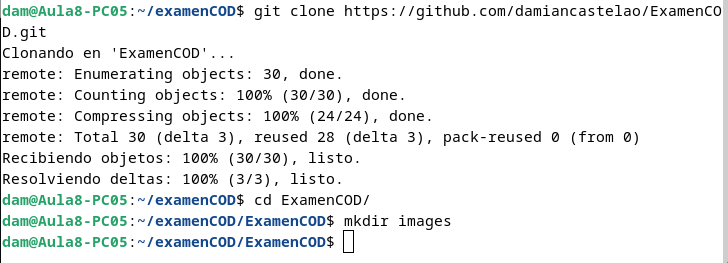
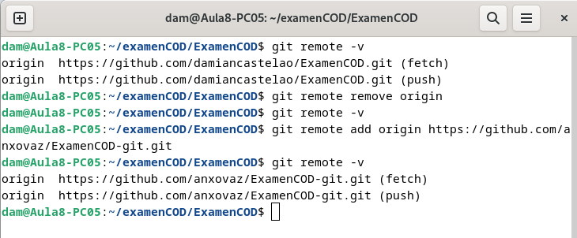
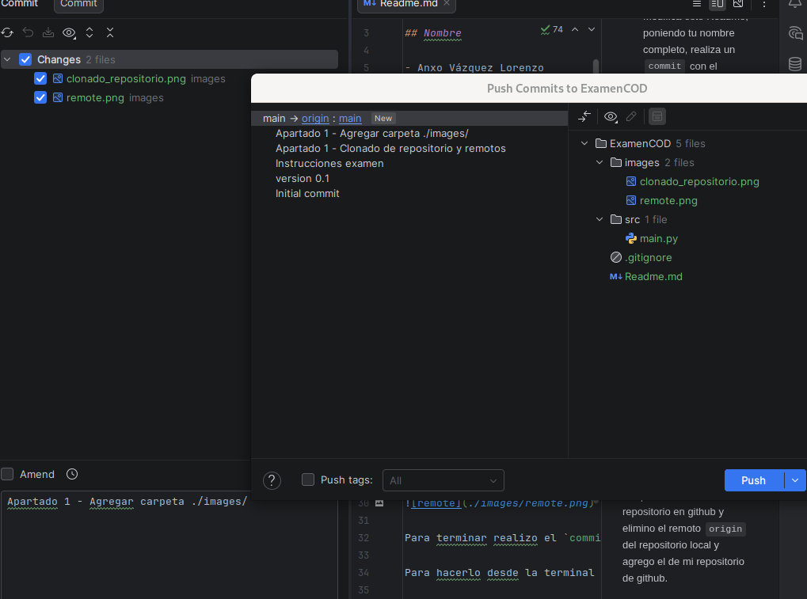
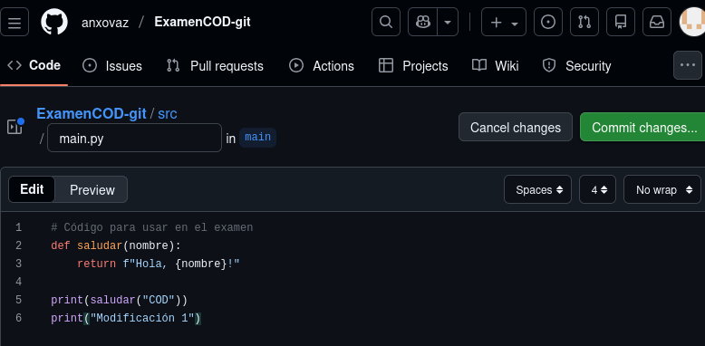
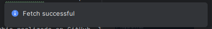
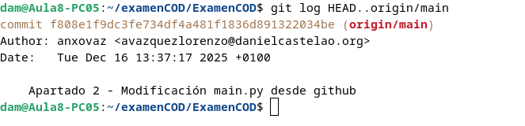
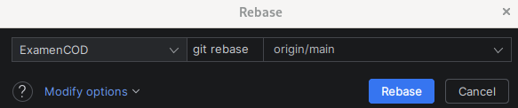
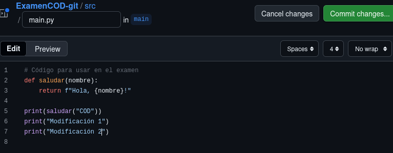
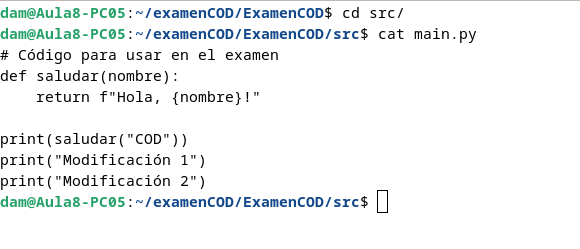

# Examen 1ª Evaluación (2ª Parte) - Control de Versiones

## Nombre

- Anxo Vázquez Lorenzo

---

## Instrucciones
- Los commits de cada apartado deben tener el mensaje *"Apartado X - descripción del cambio realizado"*
- Entrega en la tarea de Moodle tu repositorio
- Solo se corrigen los commits que estén en el repositorio remoto

### Apartado 1

- Clona este repositorio.
- Modifica este Readme, poniendo tu nombre completo, realiza un `commit` con el mensaje *"Apartado 1"* y un `push`.

Pregunta 
- ¿Qué paso es fundamental cuando clonamos un repositorio ajeno para que podamos subir nuestros propios commits? Explícalo y utiliza capturas de pantalla.

### Respuesta

Clono el repositorio con la terminal y creo un directorio llamado `images` para guardar las capturas.



Después creo un repositorio en github y elimino el remoto `origin` del repositorio local y agrego el de mi repositorio de github.



Para terminar realizo el `commit` y el `push` desde `pycharm`.

Para hacerlo desde la terminal sería:

```
git status #modificaciones
git add <archivo1> <archivo2> ...
git commit -m "Mensaje"
git push
```



### Apartado 2

- Realiza una modificación en el código en la web de tu repositorio en GitHub
- Utiliza fetch para descargar los cambios realizados en tu repositorio.

Pregunta
- Explica los pasos para que el código modificado en GitHub, llegue a tu rama principal local. Explícalo con capturas de pantalla.


### Respuesta

Primero modifico el archivo `./src/main.py` desde `github`:



Utilizo `git fetch` para descargarme los cambios con `pycharm`.

Para hacerlo desde terminal:

```
git fetch
```



Para ver lo que se ha descargado con el `fetch` uso el siguiente comando:



Ahora para que el código modificado llegue a mi rama local uso `git rebase` (también valdría `git merge` pero esto se hará en el siguiente apartado con `git pull`) desde `pycharm`.

Para hacerlo desde terminal:

```
git rebase origin/main
```



Para termninar compruebo los cambios de `./src/main.py` en local:


Realizo un `commit & Push` desde `pycharm` al repositorio remoto (el mío de `github`) con las capturas y las modificaciones del `REAMDE.md`

### Apartado 3

- Realiza otro cambio desde la web de tu repositorio en GitHub.
- Utiliza pull para descargar los cambios realizados en tu repositorio.

Pregunta
- Explica los pasos dados para que el cambio realizado en GitHub, llegue a tu rama principal local. Explícalo con capturas de pantalla.

### Respuesta

Primero realizo una modificación desde `github` a `./src/main.py`:



Ahora para traerme los cambios utilizo `git pull` desde `pycharm` que por defecto utiliza `fetch` y `merge`.

Para hacerlo desde terminal:

```
git pull #--rebase para usar rebase en vez de merge
```


Compruebo que se ha modificado `./src/main.py`:



Para terminar realizo un `commit & push` de los cambios en el `Readme.md` y capturas.

## `git log` del repositorio local

```
dam@Aula8-PC05:~/examenCOD/ExamenCOD$ git log
commit a1d77c724f8a81bfec47c4d7f040102c53b6fdbc (HEAD -> main, origin/main)
Author: anxovaz <avazquezlorenzo@danielcastelao.org>
Date:   Tue Dec 16 14:07:02 2025 +0100

    Apartado 3 - Actualización Readme.md con respuesta y capturas

commit f8755b988f880f4f0308b57383bcf5812ecff00c
Author: anxovaz <avazquezlorenzo@danielcastelao.org>
Date:   Tue Dec 16 14:00:27 2025 +0100

    Apartado 3 - Modificacion main.py desde github

commit 902932a265b16bbd4f2b08698b7a039aa2e1e1af
Author: anxovaz <avazquezlorenzo@danielcastelao.org>
Date:   Tue Dec 16 13:55:26 2025 +0100

    Apartado 2 - Modificaciones en Readme.md y capturas del apartado2

commit f808e1f9dc3fe734df4a481f1836d891322034be
Author: anxovaz <avazquezlorenzo@danielcastelao.org>
Date:   Tue Dec 16 13:37:17 2025 +0100

    Apartado 2 - Modificación main.py desde github

commit 6f8cd8ae63e3b6e46c97cc6f4e5a35f9f799a470
Author: anxovaz <avazquezlorenzo@danielcastelao.org>
Date:   Tue Dec 16 13:32:38 2025 +0100

    Apartado 1 - Imágen de push desde pycharm

commit 5dd09bae7fac5b5ec6753431929a3a39e17dd496
Author: anxovaz <avazquezlorenzo@danielcastelao.org>
Date:   Tue Dec 16 13:30:52 2025 +0100

    Apartado 1 - Agregar carpeta ./images/

commit 0077a68b421dca0d5294c8a716a8536e3f69b357
Author: anxovaz <avazquezlorenzo@danielcastelao.org>
Date:   Tue Dec 16 13:30:05 2025 +0100

    Apartado 1 - Clonado de repositorio y remotos

commit 8d2cbecd773657f189ffe4e234066a5e26566b54
Author: Damian <damiannogueiras@gmail.com>
Date:   Mon Dec 15 09:06:23 2025 +0100

    Instrucciones examen

commit d317ef03ce497ec99b6c70c6621d7a13f4692eb1 (tag: v0.1)
Author: Damian Nogueiras <damian@danielcastelao.org>
Date:   Sun Mar 3 17:05:44 2024 +0100

    version 0.1

commit ec971dc33097272b6c1049a16c887e6651cd5df7
Author: Damian Nogueiras <damian@danielcastelao.org>
Date:   Sun Mar 3 17:04:19 2024 +0100

    Initial commit


```